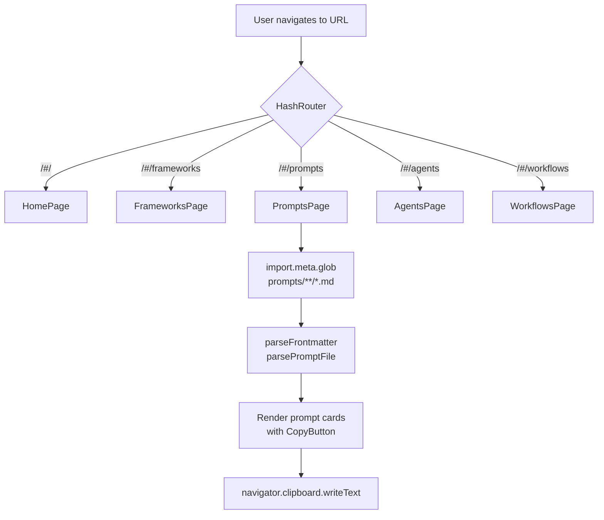
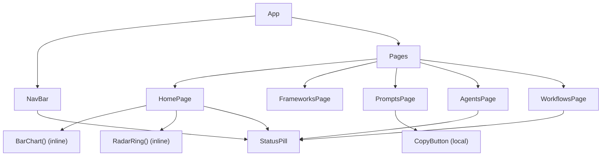

# Architecture — Invisible Signals™

## System Overview

Invisible Signals™ is a **static single-page application** backed by a **flat Markdown knowledge base**. There is no server, no database, no API, and no authentication layer. The entire system is hostable from any static file server or CDN (GitHub Pages, Netlify, Vercel, etc.).

```
┌─────────────────────────────────────────────────────┐
│                  Browser (Client Only)               │
│                                                     │
│  ┌──────────────────────────────────────────────┐   │
│  │           React SPA (HashRouter)             │   │
│  │                                              │   │
│  │  NavBar ──► Route /           ► HomePage     │   │
│  │             Route /frameworks ► FrameworksPage│   │
│  │             Route /prompts    ► PromptsPage  │   │
│  │             Route /agents     ► AgentsPage   │   │
│  │             Route /workflows  ► WorkflowsPage│   │
│  └──────────────────────────────────────────────┘   │
│                         │                           │
│          Prompts bundled at build time via           │
│          import.meta.glob (Vite)                     │
└─────────────────────────────────────────────────────┘
```

---

## Core Domains

| Domain | Location | Purpose |
|---|---|---|
| Knowledge Base | `docs/`, `frameworks/`, `prompts/`, `examples/`, `templates/` | Source-of-truth markdown content |
| Web Application | `site/` | React SPA that surfaces the knowledge base |
| Brand Identity | `assets/branding/` | Design tokens, color system, visual identity |

---

## Folder Structure

```
/
├── docs/              # Philosophy, signal stack, responsible AI use
├── frameworks/        # Hiring funnel stage guides (5 stages)
│   └── hiring-funnel/ # resume-review → onsite
├── prompts/           # AI prompts (3 production, more planned)
│   ├── resume/        # resume-signal-analysis.md
│   └── interview/     # behavioral-answer-diagnostic.md, skeptical-hiring-manager.md
├── examples/          # Annotated weak-vs-strong examples
├── templates/         # Reusable self-assessment templates
├── assets/
│   └── branding/      # Design system: tokens, colors, identity docs
│       ├── colors/    # annyce-davis-palette.css/.json (Canva Brand Kit)
│       └── tokens/    # invisible-signals-tokens.css/.json
└── site/              # Vite + React web app
    ├── index.html     # SPA shell, Google Fonts CDN link
    ├── tailwind.config.js
    ├── vite.config.js
    └── src/
        ├── App.jsx          # HashRouter, routes, layout shell
        ├── main.jsx         # React 18 mount
        ├── index.css        # Tailwind directives, global styles, component classes
        ├── components/
        │   ├── NavBar.jsx   # Global navigation
        │   └── StatusPill.jsx # Colored status badge
        └── pages/
            ├── HomePage.jsx       # Landing, hero, signal stack overview
            ├── FrameworksPage.jsx # Hiring funnel stage breakdown
            ├── PromptsPage.jsx    # Dynamic prompt loader + copy UI
            ├── AgentsPage.jsx     # Coming soon: AI agent tools
            └── WorkflowsPage.jsx  # Coming soon: workflow automation
```

---

## Request / Data Flow



**Prompt loading** is the only non-trivial data flow:

1. Vite bundles all `prompts/**/*.md` files as raw strings at build time
2. `PromptsPage.jsx` calls `import.meta.glob('../../../prompts/**/*.md', { as: 'raw' })`
3. Hand-written `parseFrontmatter()` extracts YAML keys using regex
4. Hand-written `parsePromptFile()` extracts the fenced code block under `## Prompt`
5. Prompts are sorted by category order `['resume', 'interview']` and rendered

---

## Component Architecture



**Inline sub-components** (`BarChart`, `RadarRing`) are defined inside the page file that uses them — they are not shared. Extract to `components/` only when used across multiple pages.

---

## Design Token System

```
assets/branding/tokens/
  invisible-signals-tokens.json   ← source of truth (machine-readable)
  invisible-signals-tokens.css    ← CSS custom props (--is-*)

site/tailwind.config.js           ← Tailwind color aliases (is.*)
site/src/index.css                ← Tailwind layer + global overrides
```

Token namespace: `is-*` (Tailwind classes) / `--is-*` (CSS custom properties)

| Token | Value | Role |
|---|---|---|
| `is-bg-deep` | `#05070a` | Page background |
| `is-bg` | `#0b0e14` | App surface |
| `is-surface` | `#121212` | Panels |
| `is-border` | `#262626` | 1px borders |
| `is-text` | `#e5e2e1` | Primary text |
| `is-dim` | `#737373` | Secondary/metadata |
| `is-primary` | `#70a1ff` | Signal blue |
| `is-alert` | `#e86961` | Coral/error |
| `is-warning` | `#ebbf4b` | Gold/transient |
| `is-secondary` | `#b1cccc` | Sage |

---

## External Dependencies

| Dependency | Type | Purpose |
|---|---|---|
| Google Fonts CDN | Runtime (CDN) | JetBrains Mono + Inter fonts loaded in `index.html` |
| GitHub (github.com/invisible-signals/invisible-signals) | External link | "DEPLOY_SIGNAL" NavBar button, App.jsx footer |
| `navigator.clipboard` | Browser API | Copy-to-clipboard in PromptsPage |

No other external runtime dependencies.

---

## State Management

- **No global state** — all state is local `useState` within page components
- `FrameworksPage`: `useState(null)` for accordion (selected stage ID)
- `PromptsPage`: `useState(false)` per `CopyButton` for copy confirmation toggle
- No Context, no Redux, no Zustand

---

## Architectural Constraints

| Constraint | Reason |
|---|---|
| HashRouter (not BrowserRouter) | Static hosting — no server to handle path rewriting |
| No TypeScript | Project decision — JS-only for simplicity and accessibility |
| No backend | Content is static; no dynamic data needed |
| `border-radius: 0 !important` globally | Hard brand constraint: zero-radius everywhere |
| Fonts via CDN (not bundled) | Google Fonts CDN for JetBrains Mono + Inter |
| Vite `server.fs.allow: ['..']` | Allows `import.meta.glob` to reach `prompts/` at repo root |
| No markdown parser library | `PromptsPage.jsx` uses hand-written regex to avoid adding dependencies |

---

## Deployment Topology

```
Repository (main branch)
     │ push triggers
     ▼
GitHub Actions (.github/workflows/deploy.yml)
  └─ npm ci && npm run build (from site/)
     │
     ▼
site/dist/ → pushed to gh-pages branch
     │
     ▼
GitHub Pages (serves gh-pages branch)
```

See [deployment.md](deployment.md) for full deployment guidance.
