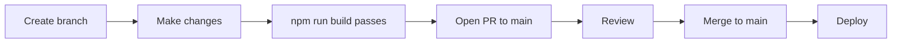

# Workflows — Invisible Signals™

## PR Workflow



### PR Checklist

- [ ] `cd site && npm run build` passes with no errors
- [ ] No `rounded-*` Tailwind classes added
- [ ] No hardcoded hex values in JSX
- [ ] No new npm deps added without justification
- [ ] No TypeScript files (`.ts`, `.tsx`) added
- [ ] No `console.log` in committed code
- [ ] New pages registered in `App.jsx` and `NavBar.jsx`
- [ ] New prompts auto-appear at `/#/prompts` (verify locally)
- [ ] Brand voice maintained (technical, precise, no hype)
- [ ] Content grounded in source material — no invented facts

---

## Code Review Expectations

| Area | Reviewer Focus |
|---|---|
| Brand compliance | No rounded corners; `is-*` tokens only; JetBrains Mono for headings |
| Architecture | No TypeScript; no backend; no state management; data co-located |
| Content accuracy | Markdown docs based on Annyce Davis source material, not invented |
| Dependency discipline | No new deps without justification; no UI libraries |
| Performance | No large new dependencies; imports are named (tree-shakeable) |
| Security | No secrets; no external API calls; no user data sent anywhere |

---

## Feature Development Lifecycle

```
1. Identify signal gap or feature request
2. Check docs/ and frameworks/ for relevant domain context
3. Check decision-records.md for relevant prior decisions
4. Create branch: feat/description
5. Implement in site/src/pages/ or prompts/ or docs/
6. Verify npm run build passes
7. Open PR with clear description
8. Merge after review
9. Deploy
```

---

## Adding a New Page

1. Create `site/src/pages/NewPage.jsx`
2. Use `StatusPill color="gold"` if not fully implemented
3. Register route in `App.jsx`:
   ```jsx
   import NewPage from './pages/NewPage'
   <Route path="/new-page" element={<NewPage />} />
   ```
4. Add to NavBar nav links array in `NavBar.jsx`:
   ```js
   { to: '/new-page', label: '_05_NEW_PAGE' }
   ```
5. Co-locate all data arrays inside the page file
6. Run `npm run build` to verify

---

## Adding a New Prompt

1. Create `prompts/{category}/prompt-name.md`
2. Add required frontmatter:
   ```yaml
   ---
   title: Human Readable Title
   category: resume | interview
   tags: [tag1, tag2]
   status: active | draft
   version: "1.0"
   ---
   ```
3. Add `## Prompt` section with fenced code block
4. Restart dev server — `import.meta.glob` is startup-time
5. Verify prompt appears at `/#/prompts`
6. No registration required — auto-discovered

---

## Adding a New Framework Document

1. Create `frameworks/{topic}/filename.md`
2. Update `frameworks/README.md` to include it in the index
3. If surfacing in `FrameworksPage.jsx`, update the `stages` array manually
4. All content must derive from Annyce Davis source material — use TODO markers for gaps

---

## Bug Fix Process

```
1. Reproduce locally: npm run dev
2. Identify root cause (check troubleshooting.md first)
3. Create branch: fix/description
4. Fix + verify npm run build passes
5. Open PR
6. Merge + deploy
```

---

## Dependency Upgrade Process

1. Check for updates: `cd site && npm outdated`
2. Review changelog for breaking changes on major version bumps
3. Update one package at a time for significant changes
4. After each update: `npm run build` and visually test all pages
5. Commit `package.json` and `package-lock.json` together

> Minor/patch updates are generally safe to batch. Major version bumps require individual testing.

---

## Release Workflow

> **TODO:** Define release tagging cadence.

Suggested process:
1. Verify `main` is in a deployable state
2. Update version badge string in `NavBar.jsx` (currently `V0.1`)
3. Tag: `git tag v0.x.0 && git push --tags`
4. Push to `main` triggers `deploy.yml` automatically
5. Verify live GitHub Pages URL

---

## Content Contribution Workflow

For contributors adding markdown content (`docs/`, `frameworks/`, `prompts/`, `examples/`, `templates/`):

1. Read `docs/responsible-ai-use.md` — understand what AI-assisted content is acceptable
2. All content must be grounded in source material (see `docs/source-material.md`)
3. Do not invent metrics, outcomes, or experiences
4. Use TODO markers for sections that need verification
5. Follow existing file structure and frontmatter schema
6. Submit via PR — content will be reviewed for accuracy and brand voice

---

## Incident Workflow

> This is a static site. "Incidents" are typically: site is down, build is broken, or content error.

| Incident Type | Response |
|---|---|
| Site unreachable | Check hosting provider status; redeploy from last good commit |
| Build broken on main | Revert offending commit; fix in a patch branch |
| Incorrect/harmful content published | Revert content commit immediately; fix and redeploy |
| Security issue reported | Remove from public view immediately; assess and fix; disclose per CODE_OF_CONDUCT.md |

---

## Hotfix Process

```bash
# From main (or last known good commit)
git checkout main
git pull
git checkout -b fix/critical-fix
# Make minimal fix
cd site && npm run build  # Verify
git commit -m "fix: description"
git push
# Open PR; merge with expedited review
# Deploy immediately after merge
```

---

## Migration Workflow

For significant structural changes (e.g., adding a new section to all prompt files, renaming a Tailwind token):

1. Audit full impact: `grep -r "old-pattern" .`
2. Document the migration in a PR description
3. Update all instances in one PR — do not leave partial migrations
4. Update relevant docs (this file, codebase-map.md, copilot-instructions.md) in the same PR
5. Add a decision record if the migration reflects a permanent architectural change
